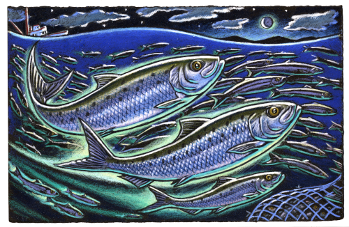

```{r setup, include=FALSE}
knitr::opts_chunk$set(echo = TRUE) 
```

<p style="text-align: center;">A Sardine Tale</p>

<p align="center"></p>

---

<p style="text-align: center;">Contents</p>

<p style="text-align: center;">
<a href="sardine_story_video.html#(2)" target="_blank">What happened to the Sardines</a></p>

<p style="text-align: center;">
<a href="sardine_story_analysis.html#(2)" target="_blank">Wendy dives into the Data</a></p>


