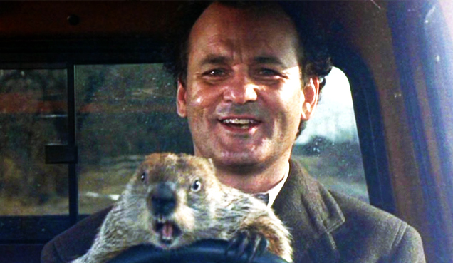

--- 
title: |
       | *Bill Murray, Groundhog Day, and Loops*
author: "Dan Maxwell"
date: "`r Sys.Date()`"
output:
  html_document: default
  pdf_document:
    fig_caption: no
header-includes: \usepackage{color}
---

```{r setup, include=FALSE}
knitr::opts_chunk$set(echo = TRUE)

```


<script src="hideOutput.js"></script>

<link rel="stylesheet" type="text/css" href="fold.css">

## Groundhog Day
In the comedy *Groundhog Day*, Bill Murray plays Phil Connors, a disgruntled TV weatherman who's sent to Punxsutawney, PA to cover the story of Punxsutawney Phil, the town's famous groundhog who can predict either an early spring or extended winter depending on whether he sees his shadow or not.  While there, Phil Connors gets caught in a time warp, reliving the same day over and over again until he learns to value each moment and the people he works with.  See the **Reference** section for links to the movie trailer as well as the film's Wikipedia entry.



## R Loops
In a programming language, loops allow you to repeat a specific action over and over again.  This grants you special powers as a programmer.  For example, you could define a groundhog loop that repeats a specified number of times, forcing Phil Connors to relive the same day until the loop reaches a defined limit.  The R code to accomplish this feat is listed below.  Try running this code in the console.

```{r eval=FALSE}

# Request user input;  i.e., the number of days to loop through.
ghog_days <- readline(prompt = "Please enter the number of groundhog days: ")

# Loop for the number of days in the ghog_days variable.
for(idx in 1:ghog_days) {
  msg <- paste("When will this day end? I've already lived it", idx, "times!")
  print (msg)
}

```

Many times our code begins to look like a bad sequel to *Groundhog Day*.  A piece of code works well so we copy it with minor modifications and then do it again and again, as in the case below. In this example, the code that creates the base life expectancy plot is created and then lines are added for each of the three countries - the key difference between each being the data set that is graphed and the line color.

```{r fig.width = 4, fig.height = 4}
# Set the working directory to the folder with the data file.
setwd("C:/informatics")

# Read the .csv file into the df_tmp dataframe.
df_tmp <- read.csv("gapminder.csv", header = TRUE, stringsAsFactors = FALSE)

# Create the base plot.
plot(1, main = "Life Expectancy", xlab = "Year", ylab = "Years", col  = "darkblue", 
     type = "l", xlim = c(1950, 2010), ylim = c(50, 85))

# Subset the data for each country and then lay down its line on the base plot.
df_gap <- df_tmp[df_tmp$country == 'United States',]        
lines(df_gap$year, df_gap$lifeExp, col = 'darkblue')          # U.S. is blue line

df_gap <- df_tmp[df_tmp$country == 'France',]
lines(df_gap$year, df_gap$lifeExp, col = 'darkred')           # France is red line

df_gap <- df_tmp[df_tmp$country == 'Brazil',]              
lines(df_gap$year, df_gap$lifeExp, col = 'darkgreen')         # Brazil is green line

```

Although this code works and correctly produces one graph with three lines, it is not optimal.  In fact, it breaks one of the cardinal rules of good programming: **Thou Shalt Not Repeat Thyself**

Rewriting the same code with minor modifications is similar to Phil Connor's experience of living groundhog day over and over.  At some point, the underlying repetition becomes unbearable.  And, in the case of code, it is unsustainable.  Imagine the maintenance nightmare if we repeated this same `lines()` code with minor modifications 10 times and then wanted to change the color of the line (The `col =` argument).  We'd have to change 10 lines of code!

So how do we put a stop to this madness?  Well, maybe we can use the idea behind our original groundhog loop to solve this problem.  Although the experience wasn't fun for Phil Connors, it might prove useful here.

The first step is to carefully compare the lines of code above to determine what changes in each sub-section.  Immediately, we see that each subsets the data from the `df_tmp` dataframe differently, with country changing each time. The color of each line also changes, differing for each country being graphed. Color and country are therefore the two variables of interest.

The second step is to create a pair of vectors, one to hold countries and a second for line colors.  Let's start by creating a vector to hold countries and modifying our code to handle that modification.  Afterwards, we'll add a second vector to the mix to hold line colors.  Here's the code with a countries vector: 

```{r fig.width = 4, fig.height = 4}
# Create a vector of the three countries to be graphed.
countries <- c('United States','France','Brazil')

# Create the base plot.
plot(1, main = "Life Expectancy", xlab = "Year", ylab = "Years", col  = "darkblue", 
     type = "l", xlim = c(1950, 2010), ylim = c(50, 85))

# Subset the data for each country in the vector via index notation and then plot.
df_gap <- df_tmp[df_tmp$country == countries[1],]           
lines(df_gap$year, df_gap$lifeExp, col = 'darkblue')          # U.S. is blue line

df_gap <- df_tmp[df_tmp$country == countries[2],]
lines(df_gap$year, df_gap$lifeExp, col = 'darkred')           # France is red line

df_gap <- df_tmp[df_tmp$country == countries[3],]
lines(df_gap$year, df_gap$lifeExp, col = 'darkgreen')         # Brazil is green line

```

At first glance, this code does not appear to be much of an advance over the original.  Rather than reference the country names directly, we're now referencing them by index, by their position in the vector.  However, the ability to reference each country by index represents a small yet crucial advance.  It means that we can use a vector (data structure) to drive and 'feed' our loop.  In fact, the basic idea behind *data-driven design patterns* is that our programs respond to changes in a dataset.  Now, the only thing that changes is the index.

Okay, let's extend this idea by adding a 2nd vector called "line_colors" for line colors.  Can you modify the code above to make this change? If you have difficulties, click the Code button to see the solution. 

<div class="fold s">

```{r fig.width = 3.75, fig.height = 3.75}

# Set the working directory to the folder with the data file.
setwd("C:/informatics")

# Read the .csv file into the df_tmp dataframe.
df_tmp <- read.csv("gapminder.csv", header = TRUE, stringsAsFactors = FALSE)

# Create a vector of the countries to be graphed.
countries <- c('United States','France','Brazil')

# Create a vector of the line colors for each country.
line_colors <- c('darkblue','darkred','darkgreen')

# Create the base plot.
plot(1, main = "Life Expectancy", xlab = "Year", ylab = "Years", col  = "darkblue", 
     type = "l", xlim = c(1950, 2010), ylim = c(50, 85))

max_rows <- NROW(countries)      

for(idx in 1:max_rows) {               
  df_gap <- df_tmp[df_tmp$country == countries[idx],]
  
  lines(df_gap$year, df_gap$lifeExp, col = line_colors[idx])
}

```

</div>

In the code above, we loop through both vectors, subsetting the data and then creating a line, using the color specified at the index of the line_colors vector.  Of course, the countries and line_colors vectors need to be the same length and align with each other.  That is, the line color at a specified index must be the one you wish to use for the country at that same index in the other vector.  For example, the line color at `line_colors[1]` is darkblue and the corresponding country at `countries[1]` is the United States.  Thus the U.S. line will be darkblue.

A generic design pattern is now coming into view.  Like the Pac-Man video game, loops "eat" data.  In other words, we often loop through a dataset to perform some action.  It does not matter how the data is stored - in a vector, a list, or a dataframe - just as long as the elements (rows) in it are accessible via index.

What makes the data-driven loop pattern so powerful is that the number of countries for which we want to draw the lines can be as large as you like without having any effect on the amount of code written. That was not the case with the earlier "cut and paste" method.

## The Dreaded Infinite Loop
At this point, you probably recognize that loops are incredibly useful when you need to repeatedly execute a specified action or set of commands.  It appears that *Groundhog Day* - at least for programmers - is a great idea.  Or is there a dark side to all this goodness?  Unfortunately, there is.  In the case of Phil Connors, the problem was that he appeared to be caught in an *infinite* loop, unable to advance through time.  The same can happen in our code, if we're not careful.

Consider the code snippet below which is a minor rework of the for-loop code presented at the beginning of this clinic.  In this example, we use a while loop instead to step through the number of days in the ghog_days variable.  However, this code creates an *infinite* loop.  Can you explain why this is so?

```{r eval=FALSE}
# Request user input;  i.e., the number of days to loop through.
ghog_days <- readline(prompt = "Please enter the number of groundhog days: ")

# Initialize the index.
idx <- 1

# Loop for the number of days in the ghog_days variable.
while(idx <= ghog_days) {
  msg <- paste("When will this day end? I've already lived it", idx, "times!")
  print (msg)
  
  # Where is idx incremented?  Can anyone say, "Infinite loop?"
}

```

Unlike our earlier for-loop which advances idx by one each time the loop executes, you must explicitly do that within a while-loop.  In the code above, we initialize idx to 1 but then fail to increment it within the loop.  Here's the line of code that's missing: `idx <- idx + 1`.  Without this line, the initial `while` condition always evaluates to TRUE because `idx` never increases to become greater than ghog_days.  Click the Code button to see how the loop should have been written to avoid this problem.  

<div class="fold s">

```{r eval = FALSE}

# Loop for the number of days in the ghog_days variable.
while(idx <= ghog_days) {
  msg <- paste("When will this day end? I've already lived it", idx, "times!")
  print (msg)
  
  # The idx is now being incremented and we have an appropriate exit condition.
  idx <- idx + 1  
}

```

</div>

> ### Tip: Exiting an Infinite Loop
>
> To break the execution of any infinite loop, press the "Esc" key.

As you can see, a `while()` loop can be a dangerous thing, specifically when no exit condition has been met.  The result, as Buzz Lightyear might say, is a loop to infinity and beyond. 

 \newline


## Review

In this myDataStory learning experience, we introduced you to R loops, using the movie *Groundhog Day* as a fun way to explore the idea of repetition in programming.  Here are the key points:

* Frequently, you will find yourself copying and pasting a block of code repeatedly, with but minor modifications.  When this happens, consider the power of loops to cut down on the amount of code you write.  Always keep this dictum in mind, "Thou shalt not repeat thyself!" 

* If you begin to repeat yourself, first determine what is changing in each block of code and then use a *data-driven* solution to eliminate the repetition.  We demonstrated how this might be accomplished using vectors, indexes, and the loop construct.  

* Avoid the dreaded infinite loop by always ensuring that an exit condition is met.  In some cases, this will require you to increment an index variable, as is the case with `while` loops.

## Problem Sets
1. How would you modify the code to compare a different set of 3 countries? What about 10 countries?

2. How would you modify the code to plot GDP instead of life expectancy?

3. How would you modify the code to use different line colors?


## References

A couple of fun *Groundhog Day* links:

* [Movie Trailer](https://www.youtube.com/watch?v=2vmmTnDJnH0)
* [Groundhog Day Wikipedia](https://en.wikipedia.org/wiki/Punxsutawney_Phil)

### Contact and Feedback
If you have any suggestions for improving this learning experience, please email them to Dan Maxwell: danielmaxwell@ufl.edu


